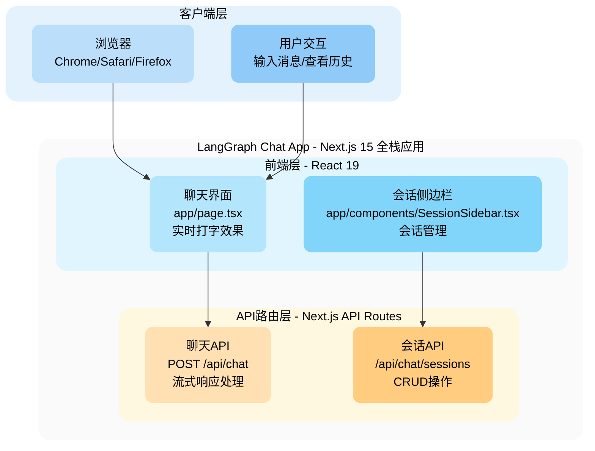

本文档记录了 Mermaid 图的绘制风格和要求，基于多轮迭代优化形成的最佳实践。

## 1. Mermaid 图表语法

### 1.1 基础语法

```mermaid
graph TB
    %% 使用 graph TB (top-bottom) 语法，避免使用 C4Context
    %% TB = 自上而下布局，适合展示层级结构
```

**重要原则**：

- ✅ 使用标准 `graph TB` 语法
- ❌ 避免使用 `C4Context`（渲染兼容性问题）
- ✅ 节点定义使用 `[标签内容]` 格式
- ❌ 避免在路径中使用前导斜杠（如 `/api/chat` 应写为 `api/chat`）

### 1.2 节点定义

```
NodeID[节点显示文本<br/>附加信息行1<br/>附加信息行2]
```

**示例**：

```
ChatAPI[聊天API<br/>POST /api/chat<br/>流式响应处理]
```

### 1.3 容器定义（Subgraph）

```
subgraph containerID["容器显示名称"]
    %% 内部节点
end
```

**示例**：

```
subgraph frontend["前端层 - React 19"]
    UI[聊天界面<br/>app/page.tsx<br/>实时打字效果]
    Sidebar[会话侧边栏<br/>app/components/SessionSidebar.tsx<br/>会话管理]
end
```

## 2. 配色方案

### 2.1 设计原则

1. **层级区分**：不同层级使用不同色系
2. **容器与节点对比**：容器背景色浅于节点颜色
3. **柔和色调**：使用浅色调（Material Design 100-400）
4. **无边框设计**：通过背景色区分，不使用边框
5. **圆角柔化**：所有元素使用圆角增强视觉柔和度

### 2.2 标准配色表

| 层级         | 容器背景色 | 节点颜色                                   | 色系           |
| ------------ | ---------- | ------------------------------------------ | -------------- |
| 客户端层     | `#e3f2fd`  | `#bbdefb`, `#90caf9`                       | 蓝色系（浅）   |
| 前端层       | `#e1f5ff`  | `#b3e5fc`, `#81d4fa`, `#4fc3f7`            | 蓝色系（极浅） |
| API 路由层   | `#fff8e1`  | `#ffe0b2`, `#ffcc80`, `#ffb74d`            | 橙色系（浅）   |
| 业务逻辑层   | `#f3e5f5`  | `#e1bee7`, `#ce93d8`, `#ba68c8`, `#ab47bc` | 紫色系（浅）   |
| 数据访问层   | `#e8f5e9`  | `#a5d6a7`, `#81c784`                       | 绿色系（浅）   |
| 外部服务     | `#ffebee`  | `#ef9a9a`                                  | 红色系（浅）   |
| 可选扩展服务 | `#f5f5f5`  | `#e0e0e0`, `#bdbdbd`                       | 灰色系（浅）   |

### 2.3 颜色选择建议

- **主色调 vs 强调色**：同一层级内使用同一色系的不同深度
- **对比度**：节点色应比容器色深 2-3 个色阶
- **可访问性**：确保文本颜色（黑色 `#000`）与背景有足够对比

## 3. 样式属性规范

### 3.1 节点样式

```
style NodeID fill:#颜色值,stroke:none,color:#000,rx:10,ry:10
```

**属性说明**：

- `fill`: 节点背景色（使用配色表中的颜色）
- `stroke`: 边框（固定为 `none`，无边框设计）
- `color`: 文本颜色（固定为 `#000` 黑色）
- `rx`: 水平圆角半径（节点固定为 `10`）
- `ry`: 垂直圆角半径（节点固定为 `10`）

**示例**：

```
style ChatAPI fill:#ffe0b2,stroke:none,color:#000,rx:10,ry:10
style SessionAPI fill:#ffcc80,stroke:none,color:#000,rx:10,ry:10
style HealthAPI fill:#ffb74d,stroke:none,color:#000,rx:10,ry:10
```

### 3.2 容器样式

```
style containerID fill:#颜色值,stroke:none,color:#000,rx:15,ry:15
```

**属性说明**：

- `fill`: 容器背景色（使用配色表中的容器颜色）
- `stroke`: 边框（固定为 `none`）
- `color`: 文本颜色（固定为 `#000`）
- `rx`: 水平圆角半径（容器固定为 `15`，比节点更圆润）
- `ry`: 垂直圆角半径（容器固定为 `15`）

**示例**：

```
style frontend fill:#e1f5ff,stroke:none,color:#000,rx:15,ry:15
style api fill:#fff8e1,stroke:none,color:#000,rx:15,ry:15
style logic fill:#f3e5f5,stroke:none,color:#000,rx:15,ry:15
```

## 4. 连接线样式

### 4.1 实线箭头

用于直接依赖或主要数据流：

```
A --> B
```

### 4.2 虚线箭头

用于可选依赖或辅助数据流：

```
A -.-> B
```

### 4.3 带标签连接线

```
A -->|标签文本| B
A -.->|可选依赖| B
```

## 5. 完整示例



## 6. 常见问题与解决方案

### 6.1 渲染错误："Unable to render rich display"

**原因**：使用了不兼容的 `C4Context` 语法

**解决方案**：改用标准 `graph TB` 语法

### 6.2 词法错误："Lexical error on line X"

**原因**：节点标签中包含前导斜杠（如 `/api/chat`）

**解决方案**：移除前导斜杠，改为 `api/chat`

### 6.3 颜色对比度不足

**原因**：节点颜色与容器背景色过于接近

**解决方案**：

- 容器使用更浅的颜色（如 `#e1f5ff`）
- 节点使用相对较深的颜色（如 `#b3e5fc`, `#81d4fa`）
- 确保至少 2-3 个色阶差异

### 6.4 颜色过深影响美观

**原因**：使用了 Material Design 600-800 深色调

**解决方案**：改用 100-400 浅色调，保持柔和视觉效果

## 7. 设计演化记录

本规范基于以下迭代优化形成：

1. **v1.0**: 使用 C4Context 语法（渲染失败）
2. **v1.1**: 改用 graph TB 标准语法，移除 emoji
3. **v2.0**: 添加分层背景色
4. **v3.0**: 应用无边框圆角设计
5. **v3.1**: 调整节点颜色为更深色调（对比度过高）
6. **v3.2**: 最终版本 - 浅色调柔和配色方案

## 8. 应用场景

- ✅ 系统架构全景图
- ✅ 组件层级关系图
- ✅ 数据流向图
- ✅ 部署拓扑图
- ✅ 技术栈可视化
- ❌ 不适合时序图（应使用 `sequenceDiagram`）
- ❌ 不适合状态机图（应使用 `stateDiagram`）

## 9. 维护建议

1. **新增层级时**：选择新的色系，更新配色表
2. **修改现有图表时**：遵循已有配色方案，保持视觉一致性
3. **发现渲染问题时**：优先检查语法兼容性，避免使用高级特性
4. **颜色选择时**：使用 [Material Design Color Tool](https://material.io/resources/color/) 确保配色和谐

## 10. 参考资料

- Mermaid 官方文档: https://mermaid.js.org/
- Material Design 配色: https://material.io/design/color/
- 项目架构文档: `/docs/architecture.md`
